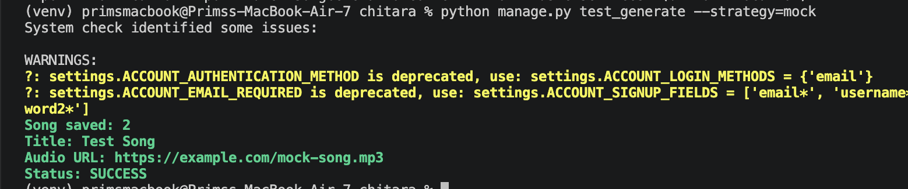
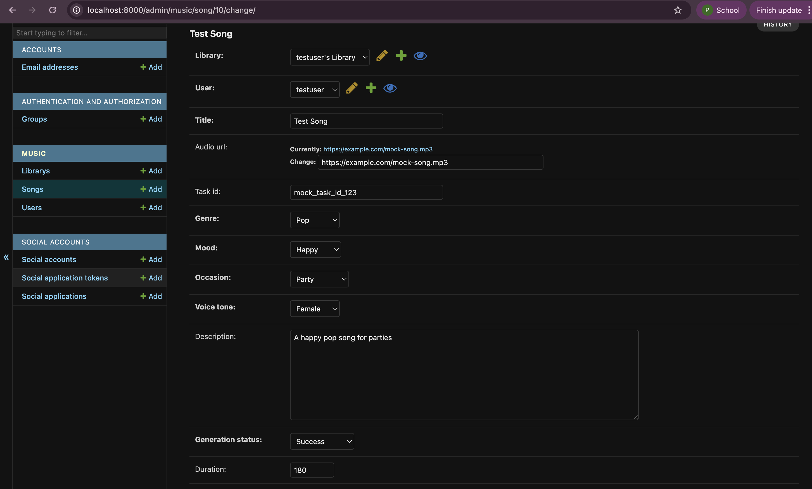
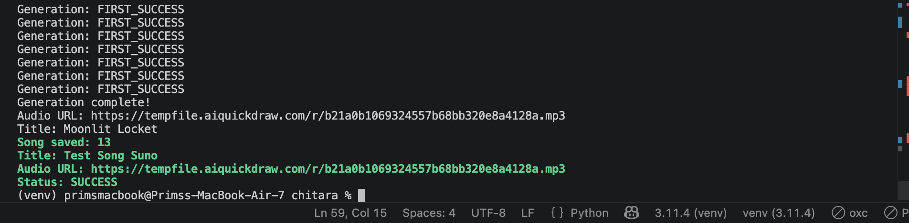
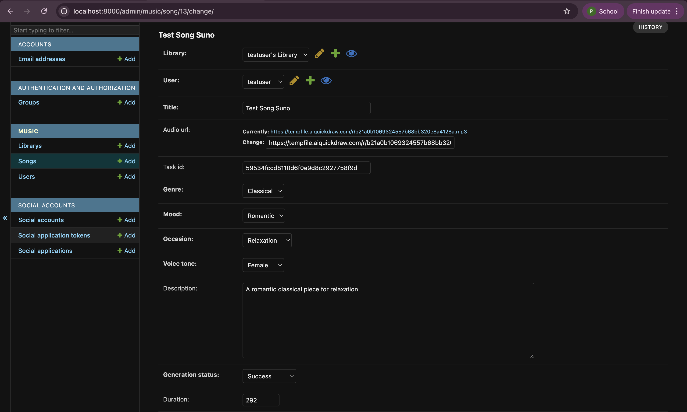
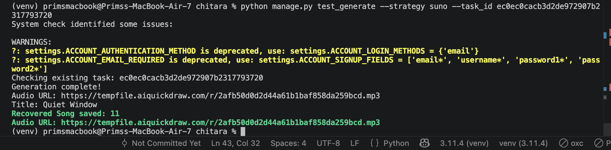
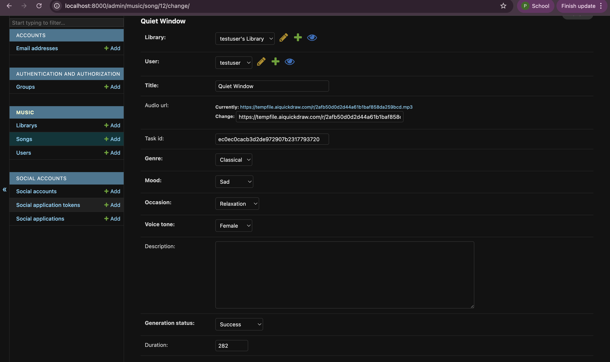

# Chitara

The Chitara project is a AI-powered song generation created by Django-based application that provides a backend for managing users, libraries, and songs. It includes features such as user authentication, song generation limits, and CRUD operations for the main domain models.

# prerequisites
- Python 3.8+

## Setup
1. Create virtual environment & Install Django
```bash
    python -m venv venv
    source venv/bin/activate  # On Windows: venv\Scripts\activate
    pip install -r requirements.txt
```
2. Run migrations:
```bash
   python manage.py migrate
```
3. Run server:
```bash
   python manage.py runserver
```
open server at http://127.0.0.1:8000/

4. (Optional) Create a superuser:
```bash
   python manage.py createsuperuser
```

### Note: Make sure to set the SUNO_API_KEY in the .env file before using the Suno strategy.
#### Example .env file:
```
SUNO_API_KEY="your_suno_api_key_here"
```
To get a SUNO_API_KEY, you can sign up for an account on the Suno website and generate an API key from your account dashboard. 
https://sunoapi.org/api-key

## How to use strategies
### Option 1: Via the test file
```bash
python manage.py test_generate --strategy=mock
python manage.py test_generate --strategy=suno # this will create a new song and print the result
python manage.py test_generate --strategy suno --task_id your_existing_task_id_here # no credit used, just check status of existing task
```
### Option 2: Via the curl command
```bash
```bash
curl -X POST http://127.0.0.1:8000/music/song/create/ \
-H "Content-Type: application/json" \
-d '{
  "title": "Test Song",
  "genre": "Classical",
  "mood": "Peaceful",
  "occasion": "Relaxation",
  "voice_tone": "Soft",
  "prompt": "Relaxing piano"
}'
```
### Option 3: Using Django Shell
1. go to terminal and run python shell
```bash
   python manage.py shell
```
2. To use mock strategy and generate a song
```python
from music.strategies.mock_strategy import MockSongGeneratorStrategy
strategy = MockSongGeneratorStrategy()

data = {
    "title": "mock song",
    "audio_url" : "https://example.com/mock-song.mp3"
}

strategy.generate(data)
```
3. To use suno strategy and generate a song
```python
from music.strategies.suno_strategy import SunoSongGeneratorStrategy

strategy = SunoSongGeneratorStrategy()

data = {
    "prompt": "A calm and relaxing piano track with soft melodies",
    "style": "Classical",
    "title": "Peaceful Piano Meditation",
    "customMode": False,
    "instrumental": True,
    "model": "V4_5ALL",
    "callBackUrl": "https://example.com/callback" 
}
strategy.generate(data)
```

## Features
- User, Library, Song domain models
- Enum-based attributes
- CRUD via Django Admin

## Demo CRUD video


## Mock Strategy
- With command: `python manage.py test_generate --strategy=mock`



## Suno Strategy
- With command: `python manage.py test_generate --strategy=suno`



- With command: `python manage.py test_generate --strategy=suno --task_id your_existing_task_id_here`

