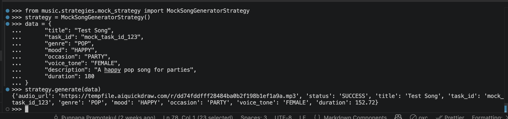
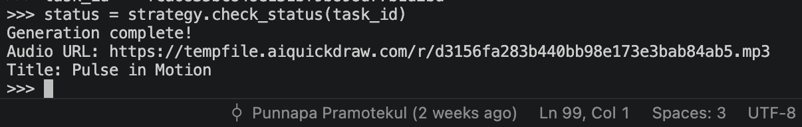
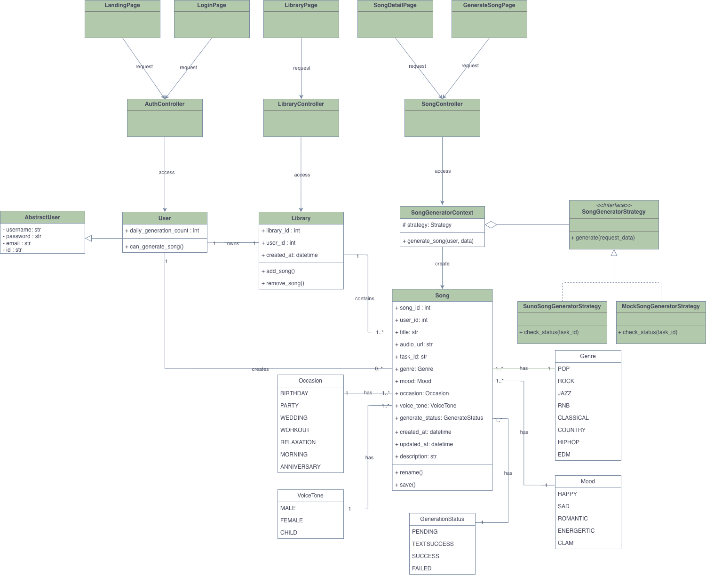
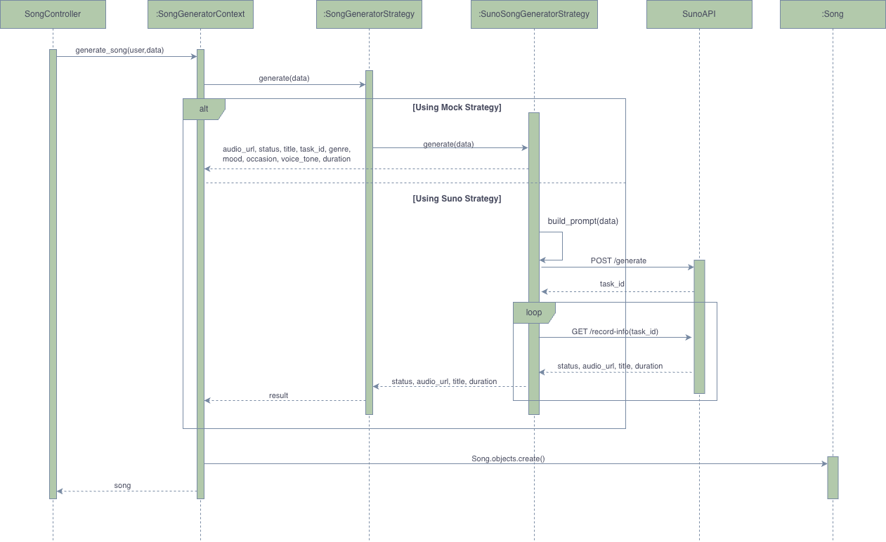
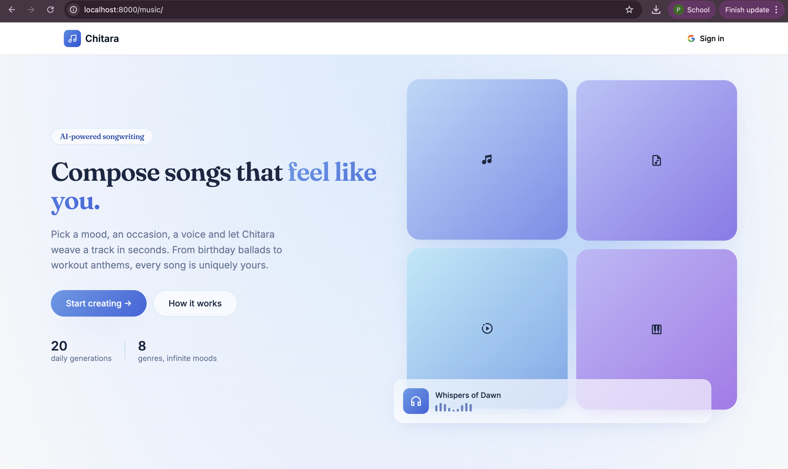
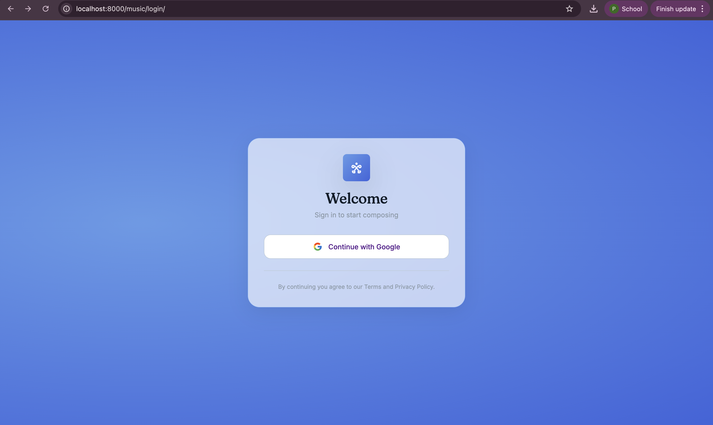
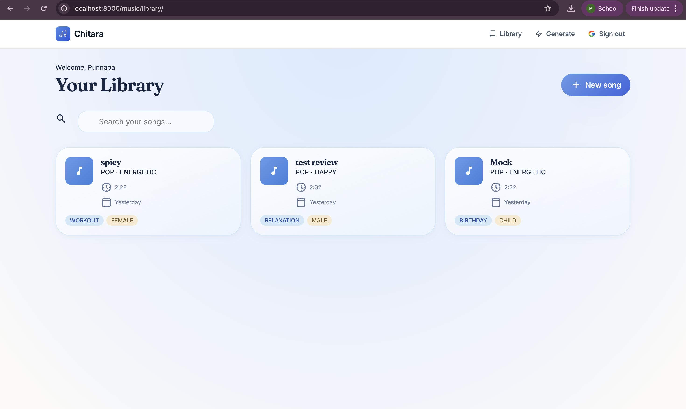
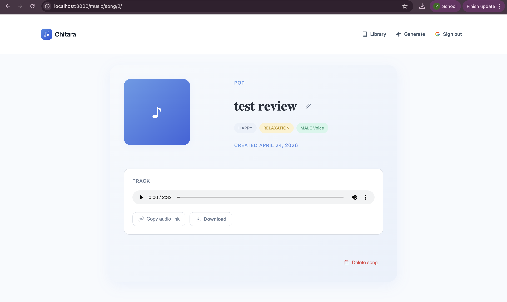
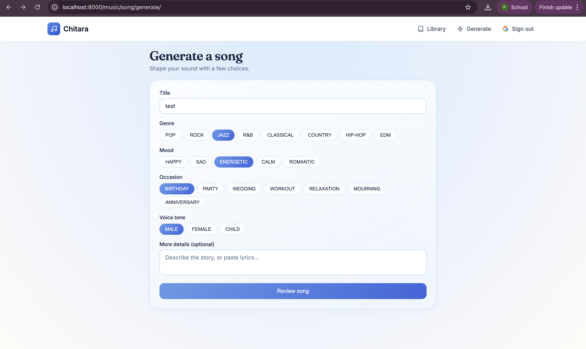
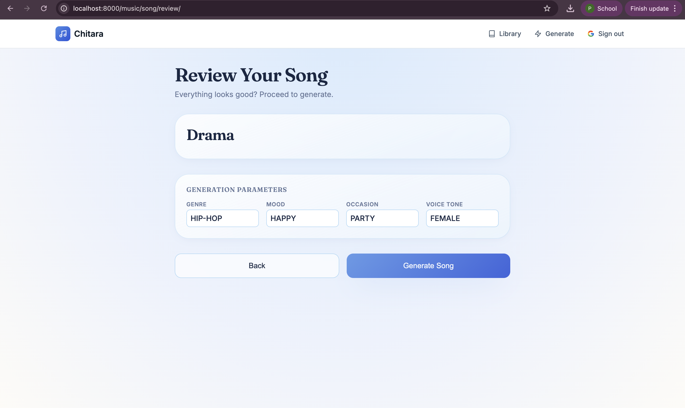

# Chitara

The Chitara project is a AI-powered song generation created by Django-based application that provides a backend for managing users, libraries, and songs. It includes features such as user authentication, song generation limits, and CRUD operations for the main domain models.

## Prerequisites
- Python 3.8+

## Setup
```bash
git clone
cd chitara https://github.com/primpunnapa/chitara.git
```
1. Create virtual environment & Install Django
```bash
    python -m venv venv
    source venv/bin/activate  # On Windows: venv\Scripts\activate
    pip install -r requirements.txt
```
2. Run migrations:
```bash
   python manage.py migrate
```
3. Run server:
```bash
   python manage.py runserver
```
open server at http://127.0.0.1:8000/

4. (Optional) Create a superuser:
```bash
   python manage.py createsuperuser
```

### Note: Make sure to set the SUNO_API_KEY in the .env file before using the Suno strategy.
#### Example .env file:
```
SUNO_API_KEY="your_suno_api_key_here"
```
To get a SUNO_API_KEY, you can sign up for an account on the Suno website and generate an API key from your account dashboard. 
https://sunoapi.org/api-key

## How to use strategies
### Option 1: Via the test file (music/management/commands/test_generate.py)
```bash
python manage.py test_generate --strategy=mock
python manage.py test_generate --strategy=suno # this will create a new song and print the result
python manage.py test_generate --strategy suno --task_id your_existing_task_id_here # no credit used, just check status of existing task and save in database if completed successfully
```
### Option 2: Test in runtime
Please make sure to set the GENERATOR_STRATEGY in the .env file before using the UI.
```bash
GENERATOR_STRATEGY="mock"  # or "suno"
```
1. run the server and login with your account
```bash
   python manage.py runserver
```
2. Go to the library page and click on "New Song" button
3. Fill in the form and click "Generate" to create a new song using the selected strategy (mock or suno)

### Option 3: Using Django Shell
1. go to terminal and run python shell
```bash
   python manage.py shell
```
2. To use mock strategy and generate a song
```python
from music.strategies.mock_strategy import MockSongGeneratorStrategy
strategy = MockSongGeneratorStrategy()

data = {
      "title": "Test Song",
      "task_id": "mock_task_id_123",
      "genre": "POP",
      "mood": "HAPPY",
      "occasion": "PARTY",
      "voice_tone": "FEMALE",
      "description": "A happy pop song for parties",
      "duration": 180
}

strategy.generate(data)
```

3. To use suno strategy and generate a song
```python
from music.strategies.suno_strategy import SunoSongGeneratorStrategy

strategy = SunoSongGeneratorStrategy()

data = {
    "prompt": "your detailed prompt here",
    "style": "your desired style here",
    "title": "your song title here",
    "customMode": False,
    "instrumental": True,
    "model": "V4_5ALL",
    "callBackUrl": "https://example.com/callback" 
}
strategy.generate(data)
```

### Check status of existing suno task
use python manage.py shell to check the status of an existing suno task by its task_id
```python
from music.strategies.suno_strategy import SunoSongGeneratorStrategy
strategy = SunoSongGeneratorStrategy()
task_id = "your_existing_task_id_here"
status = strategy.check_status(task_id)
```


## Features
- User, Library, Song domain models
- Enum-based attributes
- CRUD via Django Admin

## Class Diagram


## Sequence Diagram


## Demo CRUD video


## Mock Strategy
- With command: `python manage.py test_generate --strategy=mock`


## Suno Strategy
- With command: `python manage.py test_generate --strategy=suno`


- With command: `python manage.py test_generate --strategy=suno --task_id your_existing_task_id_here`


## Website Screenshots
- Landing Page

- Login Page

- Library Page

- Song Detail Page

- Song Generation Page

- Song Review Page

